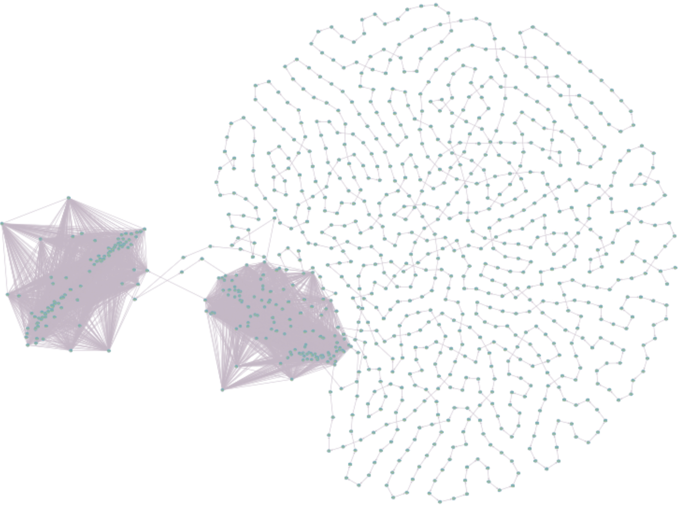

# SCC Beschreibung des Algorithmus

### Struktur:

Um alle _starke Zusammenhangskomponenten_ in einem gerichteten Graphen zu finden, müssen zunächste die _sink-Komponenten_ gefunden werden. Das sind Komponente, die keine Ausgangskanten besitzt. Denn wenn man Tiefensuche in einem _sourc-Komponent_ beginnt, kann es passieren, dass man eine andere Komponente wandert, ohne dass man es merkt. Mithilfe der Tiefensuche kann man eine _source-Komponente_ finden, die dem Knoten entspricht, der als letztes zur Sortierung hinzugefügt wird. Um nun eine _sink-Komponente_ zu finden, muss der Graph zusätzlich transponiert werden und die Tiefensuche ein zweites Mal benutzt werden. 
  Dabei werden in unserem Algorithmus folgende Funktionen aufgerufen:

1. `dfsPrint`: Tiefensuche in dem gegeben Graphen
2. `transposeGraph`: Berechnung des umgekehrten gerichteten Graphen
3. `dfsPrint2`: Tiefensuche in dem umgekehrt gerichteten Graphen

### Art und Weise:

- `dfsPrint`: In dieser Funktion wird durch eine `for-Schleife` nacheinander an allen Knoten des gegeben Graphen `dfsHelp` aufgerufen. Diese Hilfsfunktion überprüft nun ebenfalls mit einer `for-Schleife`, welche Ausgangskanten vorhanden sind, und ob die Zielknoten bereits besucht wurden. 
  Sofern eine Kante zu einem noch nicht besuchten Knoten gefunden wurde, wird `dfsHelp` an diesem Knoten aufgerufen. 
  In dem Fall das kein weiterer Knoten gefunden wird, wird der aktuelle Knoten zur `DFSOrder` hinzugefügt und die Funktion `dfsHelp` bricht ab. 
`dfsPrint` überprüft nun, ob bereits alle Knoten besucht wurden. Wenn das nicht der Fall ist, wird wieder `dfsHelp` an dem noch nicht besuchten Knoten aufgerufen. 
  Ansonsten ist die Tiefensuche beendet. 
- `transposeGraph`: In dieser Funktion wird der Graph transponiert. Das heißt die Kanten  des gerichteten ursprünglichen Graphens werden umgedreht, indem zwei ineinander verschachtelte `for-Schleifen` aufgerufen werden. Sofern sowohl eine Kante von dem Knoten a zu dem Knoten b vorhanden ist, als auch eine Kante von b zu a, muss keine Änderung vorgenommen werden. Das heißt, dass diese Funktion die Adjazenzmatrix des Graphen spiegelt. 
- `dfsPrint2`: Vom Prinzip her funktioniert diese Funktion genauso wie `dfsPrint` und benutzt somit auch `dfsHelp`. Der einzige Unterschied besteht darin, dass`dfsPrint2` die Knoten des transponierten Graphens in der Reihenfolge besucht, die in der ersten Tiefensuche in `DFSOrder` gespeichert wurde. Das entspricht der Sortierung der Knoten, die durch die Tiefensuche im gegebenen Graphen entstanden ist. 

### Komponentengraph:

Der Komponentengraph des Graphen, der durch die Datei `big_graph.csv` dargestellt wird, sieht folgendermaßen aus:

Man kann anhand des Fotos sehr gut erkennen, dass der Graph drei große starke Zusammenhangskomponenten enthält. 
